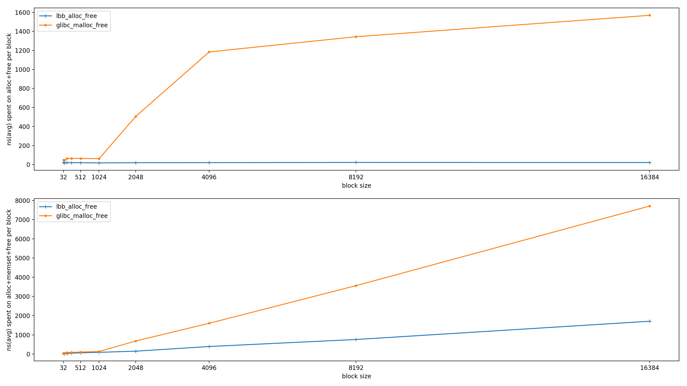

##What is lnk-bip-buf

lnk-bip-buf(Linked Bip Buffer, LBB) is a straightforward implementation of circular buffer. It aims to support the memory allocation/de-allocation based on circualr buffer in **NO STRICT FIFO realtime stream** scenarios with high performance. 

To achieve that, it links the allocated blocks one by one and introduce 3 additional states for each block. Once one block need be freed earlier than the tail of circular buffer, then just mark the block **"READY be freed"** and it will be finally committed to "free" state until the tail arriving it. 

Besides that, it also supports **VARIABLE-SIZE** blocks allocation and **NO-WRAP-AROUND** allocation in the end of buffer while there's no enough left space to fullfill the request. It will extend current block to the buffer end or add one dummy block which will link to the begin of the buffer.

it requires the buffer **MUST** be in a continuous memory area to cater the cache policy so it can reduce cache miss while handling stream data. And it's **thread-unsafe**, therefore you have to add addtional locks to handle the usage in multi-thread processing.

####Usage Example

	/* Keep this buf in a continuous physic memory location for best practice*/ 
	uint8_t buf[4096];

	/* Initalize the buffer */
	lbb_handle hdl = lbb_create_to_ext_buf(sizeof(buf), buf);

	/* Alloc one block from it*/
	void* ptr = lbb_alloc(hdl, size);

	/* Free the block */
	lbb_free(hdl, ptr);

####Perfomance 
Below is a comparation between glibc malloc/free and lnk-bip-buf alloc/free. The upper one is to compare the consumed clocks for alloc and free with series block size. And the bottom adds one time memset upon the first scenario. 

Please refer source code test/test_performance.c for the details.

## License
>This program is free software; you can redistribute it and/or modify it under
the terms of the GNU Lesser General Public License as published by the Free
Software Foundation; either version 3 of the License, or (at your option) any
later version.    

>This program is distributed in the hope that it will be useful, but WITHOUT ANY
WARRANTY; without even the implied warranty of MERCHANTABILITY or FITNESS
FOR A PARTICULAR PURPOSE. See the GNU General Public License for more details.
You should have received a copy of the GNU Lesser General Public License along
with this program. If not, see <http://www.gnu.org/licenses/>.
